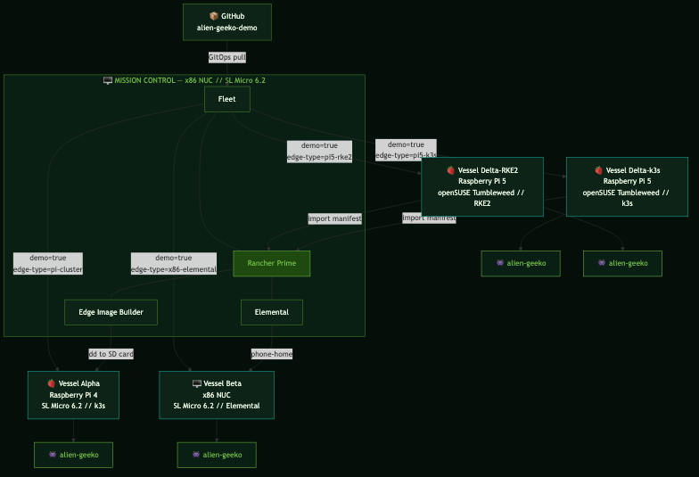

# alien-geeko

**SUSE Edge 3.5 KubeCon Demo — Mission Control**

A Node.js app that runs on every cluster in a Raspberry Pi + x86 fleet and displays live Kubernetes vitals in a Nostromo CRT terminal UI. Used as a KubeCon booth demo for SUSE Edge 3.5.

The narrative: the x86 NUC is Mission Control. The Raspberry Pi and x86 boards are vessels in the fleet. This app is the crew manifest transmitted to all vessels via Fleet.

---

## What it does

`alien-geeko` queries the Kubernetes API at runtime and renders live cluster info in the browser:

- Node count, architecture, OS image
- Kubernetes version and distribution (k3s / RKE2)
- Node role (control-plane, worker)
- Memory, CPU, load average
- Cluster display name (set per cluster via Kustomize overlay)

No persistent storage. No external dependencies at runtime. Just a service account token and the K8s API.

---

## Demo Hardware

| Role | Hardware | OS | Provisioning |
|---|---|---|---|
| Mission Control | x86 NUC | SL Micro 6.2 | Manual — runs k3s + Rancher + Fleet + Elemental |
| Vessel Alpha | Raspberry Pi 4 | SL Micro 6.2 | EIB (Edge Image Builder) |
| Vessel Beta | x86 NUC | SL Micro 6.2 | Elemental (phone-home) |
| Vessel Delta-k3s | Raspberry Pi 5 | openSUSE Tumbleweed | Rancher Import + k3s |
| Vessel Delta-RKE2 | Raspberry Pi 5 | openSUSE Tumbleweed | Rancher Import + RKE2 |
| Standby | x86 Spare NUC | SL Micro 6.2 | EIB or Import |

> **Note:** Raspberry Pi 5 (BCM2712) is NOT supported in SL Micro 6.2. Pi 5 boards run openSUSE Tumbleweed with k3s or RKE2 and are imported into Rancher. SL Micro 6.3 (planned late 2026) will add Pi 5 support.

---

## Repository Structure

```
alien-geeko/
├── README.md
├── fleet.yaml                          # Fleet GitOps bundle definition
├── alien-geeko-manifest.yaml           # Single-file bundle for manual apply
├── Dockerfile                          # BCI Node.js 20, geeko uid/gid 1000
├── LICENSE                             # Apache 2.0
├── NOTICE                              # SUSE LLC copyright
├── app/
│   ├── server.js                       # Node.js server + K8s API client
│   └── index.html                      # Nostromo CRT terminal UI (self-contained)
├── k8s/                                # Base Kubernetes manifests
│   ├── 00-namespace.yaml               # Namespace + PSA labels
│   ├── 01-rbac.yaml                    # ClusterRole + ClusterRoleBinding
│   ├── 02-deployment.yaml              # Deployment (reads CLUSTER_NAME from ConfigMap)
│   ├── 03-configmap.yaml               # CLUSTER_NAME display name
│   └── 04-service.yaml                 # NodePort :30080 (LoadBalancer commented out)
└── overlays/                           # Kustomize per-cluster customization
    ├── kustomization.yaml              # Base overlay — references k8s/
    ├── pi-cluster/
    │   └── kustomization.yaml          # Sets CLUSTER_NAME: PI-CLUSTER-ARM64
    ├── x86-cluster/
    │   └── kustomization.yaml          # Sets CLUSTER_NAME: X86-EDGE-NODE
    └── default/
        └── kustomization.yaml          # Fallback — no cluster name patch
```

---

## Architecture



---

## App Architecture

The app is a single Node.js process. No init containers, no sidecar, no volume mounts for data.

```
Browser
  └── GET /
        └── index.html (Nostromo terminal UI)
              └── polling GET /api/info every 10s
                    └── server.js
                          ├── reads /var/run/secrets/.../token on every call
                          ├── GET <kube-apiserver>/version
                          └── GET <kube-apiserver>/api/v1/nodes
                                └── caches result 60s
```

**Why re-read the token on every call:** k3s and RKE2 rotate projected service account tokens every ~1 hour. Caching the token at module load time causes auth failures mid-demo.

**Why 60s cache:** Pi nodes under load are slow. Caching avoids hammering the API.

**Why 5s timeout:** Prevents the UI from hanging on a slow or unreachable cluster.

### API endpoints

| Endpoint | Description |
|---|---|
| `GET /` | Serves `index.html` |
| `GET /api/info` | JSON cluster info (60s cache) |
| `GET /health` | `200 OK` — liveness/readiness probe |

---

## Container Image

- Base: `registry.suse.com/bci/nodejs:20` (SUSE BCI — not Alpine)
- User: `geeko`, UID/GID `1000` (explicit — not `--system`)
- Multi-arch: `linux/amd64` + `linux/arm64`
- Registry: `docker.io/avaleror/alien-geeko:latest`

> **Critical:** `runAsUser: 1000` in `k8s/02-deployment.yaml` MUST match the UID in the Dockerfile. Using `--system` gives a UID in the 100-999 range, which causes `EACCES` on `/app/server.js`.

### Build

```bash
# Multi-arch (recommended)
docker buildx build --platform linux/amd64,linux/arm64 \
  -t docker.io/avaleror/alien-geeko:1.0.1 --push .

# Per-arch + manual manifest (for native Pi builds)
docker build --platform linux/amd64 -t REGISTRY/alien-geeko:1.0.1-amd64 --push .
docker build --platform linux/arm64 -t REGISTRY/alien-geeko:1.0.1-arm64 --push .
docker manifest create REGISTRY/alien-geeko:1.0.1 \
  REGISTRY/alien-geeko:1.0.1-amd64 REGISTRY/alien-geeko:1.0.1-arm64
docker manifest push REGISTRY/alien-geeko:1.0.1
```

---

## Kubernetes Manifests

The app deploys five resources from `k8s/`, applied in order:

| File | What it creates |
|---|---|
| `00-namespace.yaml` | `alien-geeko` namespace with PSA baseline labels |
| `01-rbac.yaml` | `ClusterRole` + `ClusterRoleBinding` for node read access |
| `02-deployment.yaml` | Single-replica pod, non-root UID 1000, Downward API env vars |
| `03-configmap.yaml` | `CLUSTER_NAME` display value (patched per cluster by Kustomize) |
| `04-service.yaml` | `NodePort` on 30080 (LoadBalancer block commented out for MetalLB) |

### Manual apply (single cluster)

Use `alien-geeko-manifest.yaml` — it bundles all resources into one file:

```bash
kubectl apply -f alien-geeko-manifest.yaml
```

Or apply the base manifests directly:

```bash
kubectl apply -f k8s/
```

### Apply a specific overlay with kubectl

```bash
kubectl apply -k overlays/pi-cluster
kubectl apply -k overlays/x86-cluster
kubectl apply -k overlays/default
```

---

## RBAC

The app needs read access to nodes and the `/version` endpoint.

```yaml
ClusterRole: alien-geeko-reader
  - nodes: get, list
  - /version (nonResourceURL): get

ClusterRoleBinding: alien-geeko-reader
  subjects:
    - ServiceAccount: alien-geeko
      namespace: alien-geeko     # Must match the actual deployment namespace
```

If node count shows `?`, verify permissions:

```bash
kubectl auth can-i list nodes \
  --as=system:serviceaccount:alien-geeko:alien-geeko
# Must return: yes
```

---

## Kustomize Overlays

Each overlay patches only the `CLUSTER_NAME` value in the ConfigMap. Everything else comes from the base `k8s/` manifests.

**`overlays/pi-cluster/kustomization.yaml`** sets:
```yaml
CLUSTER_NAME: "PI-CLUSTER-ARM64"
```

**`overlays/x86-cluster/kustomization.yaml`** sets:
```yaml
CLUSTER_NAME: "X86-EDGE-NODE"
```

**`overlays/default/kustomization.yaml`** applies the base with no patch — used as the Fleet fallback for any `demo=true` cluster that doesn't match a more specific target.

To customize a cluster name, edit the relevant overlay's `kustomization.yaml` before pushing to the repo.

---

## Fleet Setup

Fleet applies the correct Kustomize overlay to each cluster based on labels. No Helm involved.

### fleet.yaml structure

```yaml
defaultNamespace: alien-geeko      # Fallback namespace — allows cluster-scoped resources through
helm:
  takeOwnership: true              # Adopts pre-existing namespace — no manual kubectl pre-steps needed

targets:
  - name: pi-arm-cluster
    clusterSelector:
      matchLabels:
        demo: "true"
        edge-type: pi-cluster
        kubernetes.io/arch: arm64
    kustomize:
      dir: overlays/pi-cluster

  - name: x86-cluster
    clusterSelector:
      matchLabels:
        demo: "true"
        edge-type: x86-cluster
    kustomize:
      dir: overlays/x86-cluster

  - name: all-demo-clusters        # Fallback — any demo=true cluster not matched above
    clusterSelector:
      matchLabels:
        demo: "true"
    kustomize:
      dir: overlays/default
```

> No `clusterSelector: {}` target. Clusters without `demo=true` get nothing.

### Cluster labels to set in Rancher

| Cluster | Labels |
|---|---|
| Vessel Alpha — Pi 4 via EIB | `demo=true`, `edge-type=pi-cluster`, `kubernetes.io/arch=arm64` |
| Vessel Beta — x86 NUC via Elemental | `demo=true`, `edge-type=x86-elemental` |
| Vessel Delta-k3s — Pi 5 k3s | `demo=true`, `edge-type=pi5-k3s`, `kubernetes.io/arch=arm64` |
| Vessel Delta-RKE2 — Pi 5 RKE2 | `demo=true`, `edge-type=pi5-rke2`, `kubernetes.io/arch=arm64` |
| Mission Control — x86 NUC | `demo=true`, `edge-type=x86-cluster` |

### Add the GitRepo in Rancher

1. Continuous Delivery > Git Repos > Add Repository
2. URL: `https://github.com/SUSE-Technical-Marketing/Alien-Geeko`
3. Branch: `main`
4. Target: **All clusters in the workspace** (label filtering is in `fleet.yaml`)

---

## EIB — Vessel Alpha (Pi 4)

EIB (Edge Image Builder) produces a raw disk image pre-baked with SL Micro 6.2, k3s, SSH, and users.

```yaml
apiVersion: 1.0
image:
  imageType: raw                # Must be raw for Pi — ISOs don't boot
  arch: aarch64
  baseImage: SL-Micro.aarch64-6.2-Default-GM-Raspberry-Pi.raw.xz
  outputImageName: vessel-alpha.raw
operatingSystem:
  users:
    - username: suse
      password: YOUR_PASSWORD
  ssh:
    enabled: true
    authorizedKeys:
      - "ssh-ed25519 AAAA..."
kubernetes:
  version: v1.29.3+k3s1
  nodes:
    - hostname: pi4-vessel-alpha
      type: server
```

Run EIB:

```bash
podman run --rm \
  -v $(pwd)/eib:/eib \
  registry.suse.com/edge/3.5/edge-image-builder:1.3.2 \
  build --definition-file vessel-alpha-config.yaml
```

Write to SD card:

```bash
# macOS
diskutil unmountDisk /dev/diskN
sudo dd if=vessel-alpha.raw of=/dev/rdiskN bs=4m status=progress && sync
diskutil eject /dev/diskN
```

> Do NOT use Raspberry Pi Imager. It reformats the partition table and breaks the image.

---

## Elemental — Vessel Beta (x86 NUC)

Vessel Beta is an x86 NUC running SL Micro 6.2 that uses Elemental for phone-home onboarding — no manual cluster setup needed.

1. Boot the NUC from an Elemental-enabled ISO or USB image
2. The node calls back to Rancher automatically on first boot
3. It appears in Rancher > Elemental inventory
4. Assign it to a cluster in the Rancher UI
5. Fleet delivers `alien-geeko` within seconds of cluster assignment

This shows the same zero-touch provisioning flow as EIB, but for hardware that shows up unannounced — no pre-baked image required.

---

## Rancher Import — Vessel Delta (Pi 5 x2)

Pi 5 (BCM2712) is not supported in SL Micro 6.2. Both Pi 5 boards run openSUSE Tumbleweed and are imported into Rancher — one with k3s, one with RKE2. This demonstrates that Fleet manages heterogeneous distributions in the same fleet without changes to the app or manifests.

### Vessel Delta-k3s

Install k3s on openSUSE Tumbleweed, then import into Rancher:

```bash
# Install k3s
curl -sfL https://get.k3s.io | sh -

# Import into Rancher — apply the cluster agent manifest from Rancher UI
kubectl apply -f <rancher-k3s-cluster-import-url>
```

Set labels in Rancher: `demo=true`, `edge-type=pi5-k3s`, `kubernetes.io/arch=arm64`

### Vessel Delta-RKE2

Install RKE2 on openSUSE Tumbleweed, then import into Rancher:

```bash
# Install RKE2
curl -sfL https://get.rke2.io | sh -
systemctl enable rke2-server.service
systemctl start rke2-server.service

# Import into Rancher — apply the cluster agent manifest from Rancher UI
kubectl apply -f <rancher-rke2-cluster-import-url>
```

Set labels in Rancher: `demo=true`, `edge-type=pi5-rke2`, `kubernetes.io/arch=arm64`

> **RKE2 note:** RKE2 enforces Pod Security Admission at `restricted` by default. The namespace in `k8s/00-namespace.yaml` already includes `pod-security.kubernetes.io/enforce: baseline` — verify it applies cleanly on the RKE2 cluster before the demo.

### Pi 5 hardware setup (both boards)

```bash
# Enable NVMe boot — set BOOT_ORDER=0xf416 via raspi-config or rpi-eeprom-config

# Enable PCIe in /boot/config.txt
dtparam=pciex1
[pi5]
dtparam=pciex1_gen=3

# Disable auto-suspend (GDM issue)
systemctl mask sleep.target suspend.target hibernate.target

# Check fan
sensors
cat /sys/class/thermal/cooling_device0/cur_state
```

---

## Accessing the App

| Method | Command |
|---|---|
| Port-forward (any cluster) | `kubectl port-forward svc/alien-geeko 8080:3000 -n alien-geeko` then open `http://localhost:8080` |
| NodePort (physical cluster) | `http://<NODE_IP>:30080` |
| Rancher UI | Cluster > Service Discovery > Services > alien-geeko |

---

## Troubleshooting

**"invalid cluster scoped object found"**
- Cause: `namespace:` used instead of `defaultNamespace:` in `fleet.yaml`
- Fix: Change to `defaultNamespace: alien-geeko`

**"namespace already exists / invalid ownership metadata"**
- Cause: Namespace pre-existed without Fleet ownership metadata
- Fix: `takeOwnership: true` in `fleet.yaml` handles this automatically. If already stuck:
  ```bash
  kubectl label ns alien-geeko app.kubernetes.io/managed-by=Helm --overwrite
  kubectl annotate ns alien-geeko \
    meta.helm.sh/release-name=alien-geeko \
    meta.helm.sh/release-namespace=alien-geeko --overwrite
  ```

**"EOF" on git clone**
- Cause: Cluster cannot reach GitHub (firewall/proxy/DNS at venue)
- Fix: Run a local Gitea on the x86 NUC and point Fleet there instead

**Node count shows "?"**
- Cause: ClusterRoleBinding `subjects.namespace` is wrong
- Fix:
  ```bash
  kubectl auth can-i list nodes \
    --as=system:serviceaccount:alien-geeko:alien-geeko
  # Must return: yes — if not, re-apply k8s/01-rbac.yaml
  ```

**EACCES on /app/server.js at startup**
- Cause: Dockerfile uses `--system` for user creation (UID < 1000) but deployment has `runAsUser: 1000`
- Fix: Use explicit `--uid 1000 --gid 1000` in Dockerfile, not `--system`

---

## Pre-Demo Checklist

- [ ] Verify image tag in `k8s/02-deployment.yaml` matches the pushed tag
- [ ] Set the right `CLUSTER_NAME` in each overlay before pushing
- [ ] Confirm `demo=true` label is set on all target clusters in Rancher
- [ ] Run `kubectl auth can-i list nodes` on each cluster — must return `yes`
- [ ] Verify PSA labels on the `alien-geeko` namespace on the RKE2 Pi 5 cluster
- [ ] Test port-forward on each cluster before the floor opens
- [ ] If venue network blocks GitHub, switch Fleet GitRepo URL to local Gitea on the NUC

---

## License

Apache 2.0 — Copyright 2025 SUSE LLC

---

## Links

- [SUSE Edge 3.5 Documentation](https://documentation.suse.com/suse-edge/3.5/)
- [Edge Image Builder](https://github.com/suse-edge/edge-image-builder)
- [Elemental](https://elemental.docs.rancher.com/)
- [Fleet](https://fleet.rancher.io/)
- [Rancher](https://rancher.com/)
